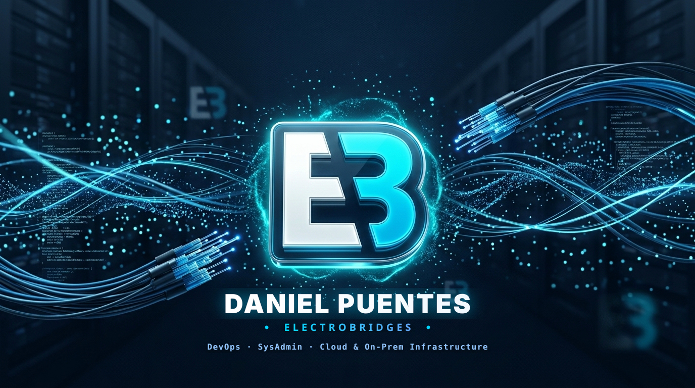

<!-- Banner -->

  

 

 

---

### 🧑‍💻 About me

I build and run **infrastructure that has to stay up** — from bare metal and hypervisors to containers, networking and monitoring, plus the automation and backend code that glues it all together.

- 🖧 **On-prem & virtualization** — **Proxmox** clusters, **Windows Server**, Linux fleets, backups and disaster recovery.
- 📦 **Containers & orchestration** — **Docker**, **Kubernetes** and **Coolify** for self-hosted deployments and PaaS-style workflows.
- 🔐 **Networking & security** — **Nginx** reverse proxies, **Cloudflare** (tunnels, WAF, DNS) and **OpenVPN** for secure remote access.
- 📈 **Observability** — **Prometheus** + Grafana dashboards and alerting, so problems surface before users report them.
- ⚙️ **Automation & backend** — CI/CD pipelines with **GitHub Actions**, scripting in Bash/Python, and services in **Python**, **Java**, **C#**, **PHP** and **Node**.

### 🚀 Currently focused on

- Hardening and automating **self-hosted / on-prem** environments (IaC, reproducible deploys, zero-touch provisioning).
- Migrating workloads to **Kubernetes** with proper monitoring, secrets management and rollback paths.
- Building internal tooling that removes manual, repetitive ops work.

---

### 🛠️ Tech stack

**Infrastructure & Virtualization**

  
  
  
  

**Containers & Orchestration**

  
  
  

**Networking & Security**

  
  
  

**Observability & CI/CD**

  
  
  
  
  

**Backend & Data**

  
  
  
  
  
  
  
  

**Web & Apps**

  
  
  
  

---

### 📌 Featured

<a href="https://github.com/electrobridges/EBS-agentic-harness"><b>🧩 EBS-agentic-harness</b></a> &nbsp;

> Multi-provider agentic workflow framework — agents backed by Claude, GPT, MiniMax, Kimi, DeepSeek, Qwen or Groq are interchangeable nodes in the same DAG. Tool use, artifacts, test-driven self-healing code generation and token accounting, on a dependency-free core.

<a href="https://github.com/electrobridges/BridgesMGR"><b>🔐 BridgesMGR</b></a> &nbsp;

> FastAPI web panel to administer an **OpenVPN** server from the browser: live connections, client certificates with ready-made `.ovpn` downloads, log viewer, three-role accounts with TOTP 2FA and a full audit trail.

<a href="https://github.com/electrobridges/OpenVPN-Manager-CLI"><b>🖥️ OpenVPN-Manager-CLI</b></a> &nbsp;

> Interactive terminal UI for an **OpenVPN** server — live connections and traffic, certificate revoke/restore, log viewer and user disconnect. Built with Rich on Python 3.8+.

<a href="https://github.com/electrobridges/Ebsv"><b>🖼️ Ebsv</b></a> &nbsp;

> **ElectroBridges Solution Visor** — fast, minimalist, GPU-accelerated image viewer for Arch Linux and Wayland/Hyprland, built with PyQt6.

---

### 📊 GitHub Stats

<!--
  Stat cards from the public github-readme-stats instance. That instance is
  frequently rate-limited (HTTP 503) and was down when this README was written,
  so it stays commented out to avoid broken images. Uncomment when it is healthy,
  or deploy your own: https://github.com/anuraghazra/github-readme-stats#deploy-on-your-own

-->

  

 

### 🧬 Conway's Game of Life

My contribution graph seeded as a Game of Life board — it wraps at the edges and reseeds itself when it stalls.

 

<picture>
  <source media="(prefers-color-scheme: dark)" srcset="https://raw.githubusercontent.com/electrobridges/electrobridges/output/game-of-life-dark.svg" />
  <source media="(prefers-color-scheme: light)" srcset="https://raw.githubusercontent.com/electrobridges/electrobridges/output/game-of-life.svg" />
  
</picture>

---

### 🤝 Let's connect

💬 Open to infrastructure challenges, automation work, and systems that need to be made reliable.

